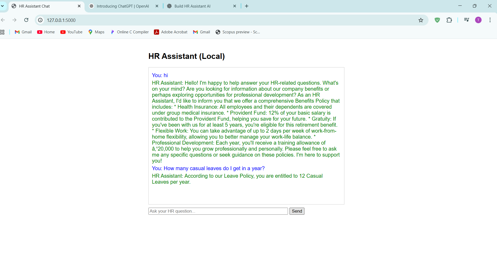
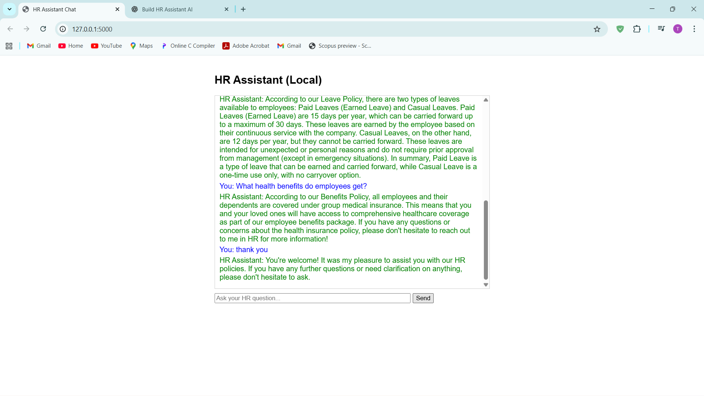

HR Assistant (Local LLM Chatbot)
Overview
This is a local HR Assistant chatbot designed to help employees get answers to HR-related questions such as leave policies, benefits, and company information. It uses a Python Flask backend, an HTML + JavaScript frontend, and a local LLM (e.g., Ollama's Llama3 or Gemma models) for natural language understanding.
Employees can ask questions like:

"How many sick leaves do I get?"
"What are the paid leave policies?"
"How can I apply for a benefit?"

Key Features

Local AI Assistant: No external API calls required (except optional OpenAI API).
HR Policy Storage: Policies are stored in text files in the policies/ folder.
Vector Search: Uses SentenceTransformers (all-MiniLM-L6-v2) and FAISS for efficient policy search.
Chat-Style Frontend: Clean, user-friendly interface for interacting with the HR assistant.
Supported Queries: Handles casual, paid, and sick leave queries (sick leave requires a medical certificate after 2 days).
Optional LLM Integration: Enhances responses using a local LLM like Llama3 or Gemma.

Limitations

Requires sufficient RAM to run local LLM models.
Answers are limited to the information in the policies/ folder.
The vector_store.pkl file (FAISS index) is generated on first run if missing.

Tools & Libraries

Python 3.x
Flask
SentenceTransformers (all-MiniLM-L6-v2)
FAISS
Ollama (for local LLM)
HTML, CSS, JavaScript (for frontend)

Project Structure
HR-Assistant-Local-LLM/
│
├── app.py                  # Flask backend
├── .gitignore              # Ignore large files
├── vector_store.pkl        # FAISS index (generated locally)
├── policies/               # HR policy text files
│   ├── leave_policy.txt
│   └── benefits.txt
└── static/
    ├── index.html          # Frontend HTML
    └── app.js              # JavaScript for chat functionality

Setup Instructions

Clone the Repository:
git clone https://github.com/yourusername/HR-Assistant-Local-LLM.git
cd HR-Assistant-Local-LLM

Set Up Virtual Environment:
python -m venv hrv
source hrv/bin/activate  # Mac/Linux
# OR
hrv\Scripts\activate     # Windows

Install Dependencies:
pip install flask sentence-transformers faiss-cpu

Install Ollama and Pull LLM Model:

Install Ollama: Follow instructions at Ollama's official site.
Pull a model (e.g., Llama3 or Gemma):ollama pull llama3  # Or gemma:2b

Run the Application:
python app.py

Access the Chatbot:

Open your browser and navigate to http://127.0.0.1:5000.

Usage

Enter HR-related questions in the chat interface.
The chatbot retrieves relevant information from the policies/ folder using vector search.
For complex queries, the local LLM (e.g., Llama3) generates natural language responses.

Example

Contributing
Contributions are welcome! Please submit a pull request or open an issue on GitHub.
License
